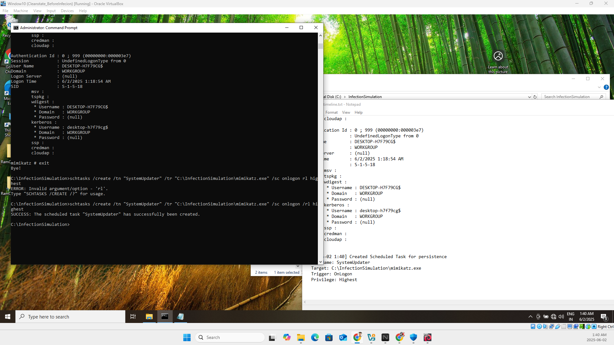
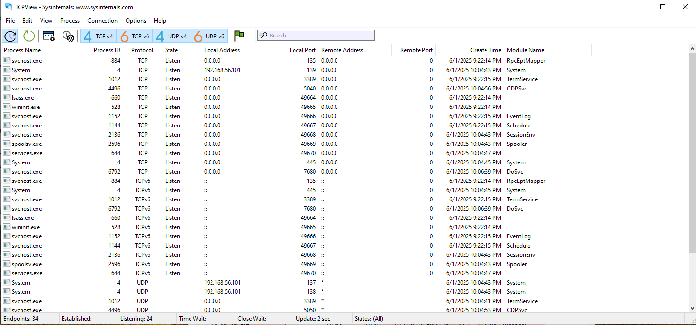

# 🧠 Memory Forensics: Credential Dumping & Persistence (IR Simulation)

## Overview

This project simulates a realistic post-exploitation scenario on a Windows 10 system involving credential dumping and persistence via scheduled tasks. The objective is to validate memory forensic workflows and document key attack artifacts using industry-standard tools such as **Volatility 3**, **Mimikatz**, and **Sysinternals**.

Memory was captured post-infection using **Belkasoft Live RAM Capturer**, and analyzed offline in Kali Linux using Volatility 3. The full digital forensics and incident response (DFIR) cycle is documented, including timeline, hash values, IOCs, MITRE ATT&CK mapping, screenshots, and actionable recommendations.

---

## 🧪 Objectives

- Emulate credential theft using Mimikatz
- Establish persistence via scheduled task (LOLBins)
- Capture volatile memory post-attack
- Perform in-depth forensic analysis using Volatility 3
- Document artifacts with a professional IR report suitable for SOC tabletop or audit

---

## ⚙️ Lab Environment

| Component       | Description                                |
|----------------|--------------------------------------------|
| Victim Machine  | Windows 10 Pro (VirtualBox)                |
| Attacker System | Kali Linux with Volatility 3               |
| Isolation       | Host-only, snapshot-controlled environment |
| Capture Tool    | Belkasoft RAM Capturer                     |
| Analysis Tools  | Volatility 3, Sysinternals, Mimikatz       |

---

## 📂 Repository Structure
## ⚙️ Key Objectives

- Perform memory acquisition after credential dumping and persistence setup
- Analyze volatile memory using Volatility 3 modules
- Identify shellcode injections, malicious tasks, and dumped credentials
- Generate indicators of compromise (IOCs) and SHA256 hashes
- Document findings in a professional incident response report

---

## 📁 Repository Structure

```plaintext
memory-forensics-incident-response/
│
├── analysis/
│   ├── memory_image/
│   │   └── 20250602.mem(for security purpose not uploaded)
│   └── volatility_outputs/
│       ├── cmdline.txt
│       ├── pslist.txt
│       ├── schedtasks.txt
│       ├── malfind.txt
│       └── mimikatz_output.txt
│
├── docs/
│   └── Incident_Response_Report.md
│
├── iocs/
│   └── hashes.csv
│
├── screenshots/
│   ├── scheduledtask.png
│   ├── tcpview.png
│   ├── attacked_cmdline.png
│   ├── mimikatz.png
│   ├── autoruns.png
│   └── process_explorer.png
│
└── README.md

```
---

## 🧠 Key Forensic Findings

- 🧬 **Memory Injection**: Shellcode found in `splunkd.exe` via RWX segment
- 🗝️ **Credential Theft**: NTLM/SHA1 hashes extracted via `sekurlsa::logonpasswords`
- 📅 **Persistence**: `schtasks` used to create `SystemUpdater` task at logon
- ❌ **Fileless Execution**: `mimikatz.exe` executed and deleted post-action
- ⚠️ **Live Artifacts**: All malicious activity detected only in RAM

---

## 🔍 Volatility 3 Modules Used

- `windows.pslist` – Process enumeration
- `windows.cmdline` – Traced attacker commands
- `windows.schedtasks` – Found scheduled persistence task
- `windows.malfind` – Detected RWX memory region
- `windows.memmap` – Verified memory region mapping

---

## 🎯 MITRE ATT&CK Mapping

| Tactic             | Technique                               | ID         | Details                             |
|--------------------|------------------------------------------|------------|-------------------------------------|
| Credential Access  | OS Credential Dumping                   | T1003.001  | `sekurlsa::logonpasswords` via mimikatz |
| Persistence        | Scheduled Task/Job                      | T1053.005  | Created via SYSTEM-level schtasks    |
| Defense Evasion    | Portable Executable Injection           | T1055.002  | RWX shellcode in `splunkd.exe`       |

---

## 📌 Hashes & Indicators of Compromise

| Type          | Value                                                                            | Source       |
|---------------|----------------------------------------------------------------------------------|--------------|
| NTLM Hash     | 9218809b443d9dd59bcc9efd18572af9                                                 | Mimikatz     |
| NTLM Hash     | 58a478135a93ac3bf058a5ea0e8fdb71                                                 | Mimikatz     |
| SHA1          | 32e5028f8b147f4d8c374bcd02d82bbe59be13c3                                         | Mimikatz     |
| SHA256 (exe)  | 8d91fa5f2f7e404a48bc9e07be331364264a9b843ea9c1f3a31fa1b4abebd9bc                  | certutil     |
| SHA256 (mem)  | 1256e83e726d2c647b8bfe66d3c7332a92f8a4b7f88c47e2b90d9a7bccefef2d                  | memdump      |
| ScheduledTask | `SystemUpdater`                                                                 | TaskSched    |
| RWX Memory    | 0x22ae5b60000 – 0x22ae5b6ffff (PID 3116)                                        | malfind      |

---

## 📷 Screenshots

| Description | Preview |
|-------------|---------|
| Scheduled Task Created |  |
| Credential Dump Output |  |
| TCPView Before Attack  |  |
| Autoruns Registry Keys |  |
| Process Explorer View  |  |

---

## 🧯 DFIR Recommendations

### 🛡️ For SOC / Detection Engineering
- **Deploy hash-based alerts** for IOCs
- **Monitor for RWX memory allocation** in non-browser/system processes
- Enable **EDR memory scanning** with YARA rules

### 🛠️ For IT Operations
- Apply **LSASS protection** (`RunAsPPL`)
- Audit SYSTEM-created **scheduled tasks** via Event IDs 4698 and 106
- Limit **PowerShell to Constrained Mode**

### 🔐 For Endpoint Security
- Block execution from user-writeable directories using **AppLocker**
- Enforce **CIS benchmark baselines** on Windows endpoints
- Review **autorun registry keys** for unauthorized additions

---

## 🧾 Incident Response Report

A detailed human-written IR document is available in:

[`docs/Incident_Response_Report.md`](docs/Incident_Response_Report.md)

This includes:
- Full forensic walkthrough
- Attack timeline
- Screenshots and findings
- MITRE mapping and recommendations

---

## 🔗 References

- [Volatility 3 Framework](https://github.com/volatilityfoundation/volatility3)
- [Mimikatz](https://github.com/gentilkiwi/mimikatz)
- [Belkasoft RAM Capturer](https://belkasoft.com/ram-capturer)
- [MITRE ATT&CK Framework](https://attack.mitre.org/)

---

> 💡 **Note**: This simulation is for educational and internal threat-hunting purposes only. All data is synthetic, and no real users or systems were harmed.
